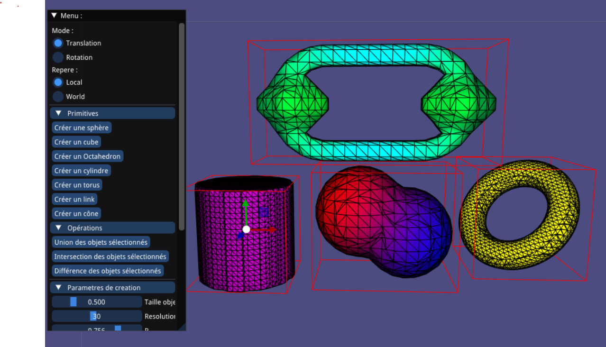

# Procedural SDF Editor – C++ / OpenGL / libigl

Procedural 3D geometry editor based on Signed Distance Functions (SDF) and Marching Cubes.

The project supports:

* Procedural primitive generation
* Recursive boolean operations
* Real-time mesh reconstruction
* Interactive transformations with ImGui and ImGuizmo
* Recursive color interpolation based on SDF distances

Developed as part of a Numerical Geometry project at the University of Strasbourg.

---

## Preview

<p align="center">
  
</p>

---

## Features

### Procedural primitives

* Sphere
* Cube
* Cylinder
* Cone
* Torus
* Link
* Octahedron

### Boolean operations

* Union
* Intersection
* Difference

### Technical highlights

* Signed Distance Functions (SDF)
* Marching Cubes mesh reconstruction
* Recursive SDF evaluation
* Recursive color interpolation
* Real-time object manipulation

---

## Technologies

* C++17
* OpenGL
* libigl
* Eigen
* GLFW
* ImGui
* ImGuizmo

---

## Build

```bash
cmake -B build -S .
cmake --build build -j4
```

---

## Authors

* Nicolas Ventadoux
* Lucas Smati
* Ugo Berton
